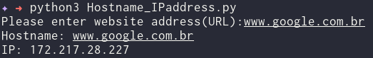

# Get Ipaddress and Hostname of Website
This project allows you to retrieve the IP address of a given hostname using a simple Python script. The logic is modularized for clarity and maintainability.

### Prerequisites
- Python 3.x

### How to run the script
1. Ensure you have Python 3 installed on your system.
2. Run the script using the command: `python3 Hostname_IPaddress.py`

### Screenshot

## Author
[Nuh Mohammed](https://github.com/NuhMohammed)
